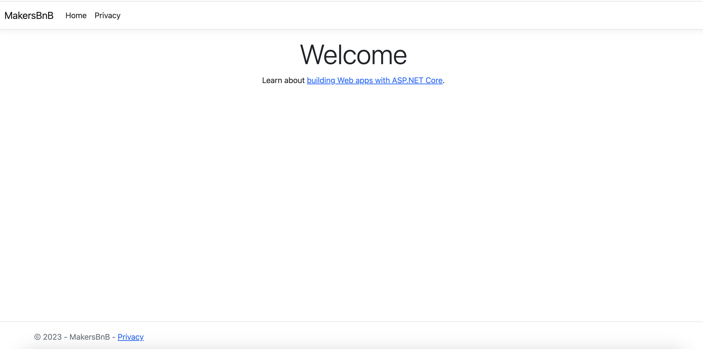

# Initial Setup

_**This is a Makers Bite.** Bites are designed to train specific skills or
tools. They contain an intro, a demonstration video, some exercises with an
example solution video, and a challenge without a solution video for you to test
your learning. [Read more about how to use Makers
Bites.](https://github.com/makersacademy/course/blob/main/labels/bites.md)_

<!-- OMITTED -->

Learn to set up a new ASP.NET project from scratch.

## Introduction

In the previous module, you used `dotnet` to create Console Applications on the command line. In this module, you'll use it to create ASP.NET web applications.

### .NET

As before, you'll create several projects which are brought together by one solution.

1. Create a new directory called `makersbnb` for your solution and `cd` into it
2. Do `dotnet new sln` to create a new solution
3. Do `dotnet new mvc --name MakersBnB` to create a new ASP.NET MVC project
4. Do `dotnet sln add MakersBnB/MakersBnB.csproj` to add your new MVC project to your solution
5. Create a new directory called `MakersBnB.Tests` and `cd` into it
6. Do `dotnet new nunit` to create your new NUnit project
7. Do `dotnet add reference ../MakersBnB/MakersBnB.csproj` to add a reference to the MakersBnB project
8. `cd` back up to the directory containing your solution file
9. Do `dotnet sln add MakersBnB.Tests/MakersBnB.Tests.csproj` to add your NUnit project to your solution

### Run the tests

As you saw previously, `dotnet` creates an example test for you in all new NUnit projects. Run the test now to ensure your initial setup has worked. To do this, `cd` into `MakersBnB.Tests` then do `dotnet test` - the one test should pass.

### Start the server

You should now be able to start a server. To do this, `cd` into `MakersBnB` and do `dotnet run`. You will see something like this...

```shell
info: Microsoft.Hosting.Lifetime[14]
      Now listening on: http://localhost:5106
info: Microsoft.Hosting.Lifetime[0]
      Application started. Press Ctrl+C to shut down.
info: Microsoft.Hosting.Lifetime[0]
      Hosting environment: Development
info: Microsoft.Hosting.Lifetime[0]
      Content root path: /Users/eddie/development/csharp/web/makersbnb/MakersBnB
```

In your output, look for the equivalent of `Now listening on: http://localhost:5106` to find out what port your server is running on. Then go to that if you `command + click` on `localhost` your browser will open and navigate to that address. Alternatively you can just pop it in the address bar.

You should see a page like this.



> You can also use `dotnet watch` to start your server. This approach means your server will automatically reload after **most** (but not all) changes. I.e. When debugging, be sure to check that the server is definitely restarting as you make changes.

### Project Structure

We're going to build an application using the Model View Controller (MVC) pattern and, helpfully, `dotnet` already created a great starting point for us - take a look around inside MakersBnB and you'll find directories called `Models`, `Views` and `Controllers`.
<br>
<details>
  <summary>Wait!! What is the MVC pattern??</summary>
  <p>
    You <em>could</em> create an entire web application using one single file of code but, as you can imagine, that file would be huge and hard to read. So, it makes sense to break up your codebase into multiple files and there are different ways of doing that. These different approaches are sometimes called 'patterns'. Using the MVC pattern, the codebase is split up such that models, views and controllers are all defined in their own files.
    <ul>
      <li>Views, also known as templates, describe what the user sees. Most of the time, they are HTML files.</li>
      <li>Controllers handle incoming HTTP requests. In previous projects, you might gave had just the one controller (`app.py`)</li>
      <li>Models contain the applications data and business logic. For example, in a <a href="https://github.com/makersacademy/databases-in-python/blob/main/challenges/02_test_driving_model_repository_classes.md#models-and-repositories">previous exercise</a>, there was an <code>Artist</code> model</li>
    </ul>
  </p>
</details>
<br>

## Demonstration

<!-- OMITTED -->

[Demonstration Video]())

## Exercise

Spend a short while browsing thew MakersBnB codebase. You will probably find a lot of stuff that doesn't yet make sense - that's OK, just make a note of any bits that are totally baffling. You can then use these notes later on to steer and / or track your learning.


[Next Challenge](02_templates_bite.md)

<!-- BEGIN GENERATED SECTION DO NOT EDIT -->

---

**How was this resource?**  
[😫](https://airtable.com/shrUJ3t7KLMqVRFKR?prefill_Repository=makersacademy%2Fcsharp_web_applications&prefill_File=bites%2F01_initial_setup_bite.md&prefill_Sentiment=😫) [😕](https://airtable.com/shrUJ3t7KLMqVRFKR?prefill_Repository=makersacademy%2Fcsharp_web_applications&prefill_File=bites%2F01_initial_setup_bite.md&prefill_Sentiment=😕) [😐](https://airtable.com/shrUJ3t7KLMqVRFKR?prefill_Repository=makersacademy%2Fcsharp_web_applications&prefill_File=bites%2F01_initial_setup_bite.md&prefill_Sentiment=😐) [🙂](https://airtable.com/shrUJ3t7KLMqVRFKR?prefill_Repository=makersacademy%2Fcsharp_web_applications&prefill_File=bites%2F01_initial_setup_bite.md&prefill_Sentiment=🙂) [😀](https://airtable.com/shrUJ3t7KLMqVRFKR?prefill_Repository=makersacademy%2Fcsharp_web_applications&prefill_File=bites%2F01_initial_setup_bite.md&prefill_Sentiment=😀)  
Click an emoji to tell us.

<!-- END GENERATED SECTION DO NOT EDIT -->
