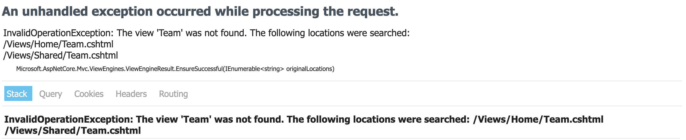

# Controllers

_**This is a Makers Bite.** Bites are designed to train specific skills or
tools. They contain an intro, a demonstration video, some exercises with an
example solution video, and a challenge without a solution video for you to test
your learning. [Read more about how to use Makers
Bites.](https://github.com/makersacademy/course/blob/main/labels/bites.md)_

<!-- OMITTED -->

Learn to handle requests using controllers in an ASP.NET project.

## Introduction

So far, you've used `dotnet` to build an ASP.NET template application and you've started to customise the front end. In this bite, you'll learn how to make the application handle new requests.

At the moment, it can only handle requests to

- `GET "/"`
- `GET "/Home"`
- `GET "/Home/Privacy"`


### Adding to a Controller

Let's extend the app so it can handle `GET "/Home/Team"`. This new request would be handled by the existing `HomeController` and introduce the user to your imaginary MakersBnB team.

Let's start by looking at what's already there.

```cs
// in Controllers/HomeController.cs

// some imports
using System.Diagnostics;
using Microsoft.AspNetCore.Mvc;
using MakersBnB.Models;

// a namespace declaration
namespace MakersBnB.Controllers;

// the HomeController class inherits from the Controller class
// this means it can do everything the Controller class can do
// plus whatever is defined in the HomeController class
public class HomeController : Controller
{
    // ths is just for logging
    private readonly ILogger<HomeController> _logger;

    // the constructor
    public HomeController(ILogger<HomeController> logger)
    {
        _logger = logger;
    }

    // `GET "/"` and `GET "/Home"` are handled by this method 
    public IActionResult Index()
    {
        // ASP.NET will default to using a template with the same name
        // as the method (Index.cshtml)
        return View();
    }

    // `GET "/Home/Privacy"` is handled by this method
    public IActionResult Privacy()
    {
        // ASP.NET will default to using a template with the same name
        // as the method (Privacy.cshtml)
        return View();
    }

    // `GET "/Home/Error"` is handled by this method
    [ResponseCache(Duration = 0, Location = ResponseCacheLocation.None, NoStore = true)]
    public IActionResult Error()
    {
        // ASP.NET will default to using a template with the same name
        // as the method (Error.cshtml)
        return View(new ErrorViewModel { RequestId = Activity.Current?.Id ?? HttpContext.TraceIdentifier });
    }
}
```

OK so we can see how _some_ of this works but there's a crucial part missing. How do specific requests get mapped onto specific methods? I.e. How does `GET "/Home/Error"` end up being handled by the `Error` method in the `HomeController`?

ASP.NET is doing a bit of work for you here. When you create a controller, the `HomeController` for example, it creates a set of routes which start `"/Home` and then, in most cases, a specific route for each method on your controller, `Error` for example.

So if we wanted to extend the `HomeController` to handle `GET "/Home/Team` all we need to do is add in a `Team` method.

```cs
public IActionResult Team()
  {
      return View();
  }
```

What should we do now? Try running the app and navigating to "/Home/Team". You should see this...



The ASP.NET tries to find a template called `Teams.cshtml` by looking in `Views/Home` and `Views/Shared` but it's not there.

#### Interlude: Build a Template

It's a bit of a tangent away from the main learning objective of this bite but you need a new template so let's build one. Create a new file in `Views/Home` called `Team.cshtml` and add the following.

```html
@{
    ViewData["Title"] = "Our Team";
}

<div class="text-center">
    <h1 class="display-4">Meet the Team</h1>
    <ul>
      @{
        string[] team = new string[2] {"anisha", "jonas"};

        foreach(string person in team) {
          <article>@person</article>
        }
      }
    </ul>
</div>
```

Now you should be able to visit "/Home/Team" without any errors.

### A New Controller

Now let's extend the application further so it can respond to `GET "/Spaces"`

Spaces-related requests should be handled by their own controller so let's create that. First, make a new file called `SpacesController` in the `Controllers` directory and add the following...

```cs
using Microsoft.AspNetCore.Mvc;

namespace MakersBnB.Controllers;

public class SpacesController : Controller
{
    private readonly ILogger<SpacesController> _logger;

    public SpacesController(ILogger<SpacesController> logger)
    {
        _logger = logger;
    }

    // will handle `GET "/Spaces"`
    public IActionResult Index()
    {
        // will try to find Spaces.cshtml in Views/Spaces or Views/Shared
        return View();
    }
}
```

Now try navigating to "/Spaces" - you should see an error message.

#### Interlude: Build Another Template

- Create new directory called `Spaces` in `Views` and then create a new file called `Index.cshtml` in there.
- Feel free to customise your new template in any way you like
- The request to `GET "/Spaces"` should now work

### Passing Data into Views

Eventually, you'll want to pass data from your a controller to a view - perhaps it's data retrieved from a database. There are a few approaches. I'll introduce one of them below and you'll see another option later on in the Models bite.

#### `ViewBag`

The `ViewBag` is basically a container into which you can package anything you would like to make available in your view. For example, if you had a list of names that you would like to pass into your view...

```cs
// controller code
public IActionResult Index()
{
  // put some names in ViewBag
  ViewBag.Names = new string[2] {"trevor", "pauline"};
  return View();
}
```

```html
<!-- view code -->
<ul>
  @{
    foreach(string name in ViewBag.Names) {
      <li>@name</li>
    }
  }
<ul>
```

Give the above a try in your codebase.

## Demonstration

<!-- OMITTED -->

[Demonstration Video]()

## Exercise

Add a method to the `HomeController` which handles the `GET "/contactus"` request and returns a view with a fake email address on it. The fake email should be pass into the view from the controller using `ViewBag`

> Test that you have done this correctly by starting / restarting your server and going to `localhost:5106/contactus` - you should see your fake email address on the page


[Next Challenge](05_models_bite.md)

<!-- BEGIN GENERATED SECTION DO NOT EDIT -->

---

**How was this resource?**  
[😫](https://airtable.com/shrUJ3t7KLMqVRFKR?prefill_Repository=makersacademy%2Fcsharp_web_applications&prefill_File=bites%2F04_controllers_bite.md&prefill_Sentiment=😫) [😕](https://airtable.com/shrUJ3t7KLMqVRFKR?prefill_Repository=makersacademy%2Fcsharp_web_applications&prefill_File=bites%2F04_controllers_bite.md&prefill_Sentiment=😕) [😐](https://airtable.com/shrUJ3t7KLMqVRFKR?prefill_Repository=makersacademy%2Fcsharp_web_applications&prefill_File=bites%2F04_controllers_bite.md&prefill_Sentiment=😐) [🙂](https://airtable.com/shrUJ3t7KLMqVRFKR?prefill_Repository=makersacademy%2Fcsharp_web_applications&prefill_File=bites%2F04_controllers_bite.md&prefill_Sentiment=🙂) [😀](https://airtable.com/shrUJ3t7KLMqVRFKR?prefill_Repository=makersacademy%2Fcsharp_web_applications&prefill_File=bites%2F04_controllers_bite.md&prefill_Sentiment=😀)  
Click an emoji to tell us.

<!-- END GENERATED SECTION DO NOT EDIT -->
