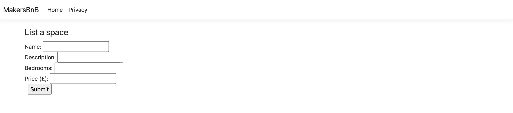

# Forms

_**This is a Makers Bite.** Bites are designed to train specific skills or
tools. They contain an intro, a demonstration video, some exercises with an
example solution video, and a challenge without a solution video for you to test
your learning. [Read more about how to use Makers
Bites.](https://github.com/makersacademy/course/blob/main/labels/bites.md)_

- Learn to build forms in ASP.NET
- Learn to handle form submission in ASP.NET

## Introduction

By the end of this bite, you'll be able to create spaces using a form! How exciting. Also, you already know more than half of what's needed here because the form will (initally) be a pretty standard HTML form.

Create a new file called `New.cshtml` in `Views/Spaces` and add the following...

```html
<form action="/Spaces" method="post">
  <fieldset>
    <legend>List a space</legend>
    <div>
      <label>Name <input type="text" name="name" /></label>
    </div>
    <div>
      <label>Description <input type="text" name="description" /></label>
    </div>
    <div>
      <label>Bedrooms <input type="text" name="bedrooms" /></label>
    </div>
    <div>
      <label>Price <input type="text" name="price" /></label>
    </div>
    <div>
      <input type="submit" value="Submit" class="submit" />
    </div>
  </fieldset>
</form>
```

Now we need two new controller methods - one to return the form and one to handle form submission. The first request, to get the form, is going to be `GET "/Spaces/New"` - this is the standard request for a form to create a new thing. If we were working with books, the request would be `GET "/Books/New"`.

```cs
public IActionResult New()
{
    return View();
}
```

Start / restart your server now and go to `/Spaces/New` - you should see your form there.



Next we need to tell the application how to handle the `POST "/Spaces/Create"` request which is generated when your new form gets submitted.

```cs
// In this case we need a custom route mapping
// we also need to specify that we're handling a POST request
// to differentiate from Index(), which handles 'GET "/spaces"'
[Route("/Spaces")]
[HttpPost]
public IActionResult Create(Space space)
{   
  MakersBnBDbContext dbContext = new MakersBnBDbContext();
  // Here's where we finally use the dbContext
  dbContext.Spaces.Add(space);
  dbContext.SaveChanges();

  // redirect to "/Spaces"
  return new RedirectResult("/Spaces");
}
```

Once you have implemented the form and updated your `SpacesController`, you should be able to use the form to create a space. Give it a try and then use `psql` or `TablePlus` to see if it worked.

## Conventions

What we've done here is quite conventional and can be used in many different situations, with small modifications. So, it's worth taking a moment to recap the steps.

- `GET "/Spaces/New"` retrieves the form
- Submitting the form generates a `POST "/Spaces"` request
- The controller handles the request and redirects to `GET "/Spaces"`

The above can work for any form submission flow. If we were working with books, for example...

- `GET "/Books/New"` would retrieve the form
- Submitting the form would generate a `POST "/Books"` request
- The controller would handle the request and redirect to `GET "/Books"`

## Demonstration

<!-- OMITTED -->

[Demonstration Video]())

## Exercise

- Update the `Space` model to include a `string Rules` field
- Generate and run a migration to update the table
- Update the form so that a user can set some rules for their space
- Update `SpacesController.Index` method so that it retrieves spaces from the database
- The spaces should then be passed into the `Spaces/Index` view
- In the `Spaces/Index` view, show a list of all the spaces


[Next Challenge](09_signing_up_bite.md)

<!-- BEGIN GENERATED SECTION DO NOT EDIT -->

---

**How was this resource?**  
[😫](https://airtable.com/shrUJ3t7KLMqVRFKR?prefill_Repository=makersacademy%2Fcsharp_web_applications&prefill_File=bites%2F08_forms_bite.md&prefill_Sentiment=😫) [😕](https://airtable.com/shrUJ3t7KLMqVRFKR?prefill_Repository=makersacademy%2Fcsharp_web_applications&prefill_File=bites%2F08_forms_bite.md&prefill_Sentiment=😕) [😐](https://airtable.com/shrUJ3t7KLMqVRFKR?prefill_Repository=makersacademy%2Fcsharp_web_applications&prefill_File=bites%2F08_forms_bite.md&prefill_Sentiment=😐) [🙂](https://airtable.com/shrUJ3t7KLMqVRFKR?prefill_Repository=makersacademy%2Fcsharp_web_applications&prefill_File=bites%2F08_forms_bite.md&prefill_Sentiment=🙂) [😀](https://airtable.com/shrUJ3t7KLMqVRFKR?prefill_Repository=makersacademy%2Fcsharp_web_applications&prefill_File=bites%2F08_forms_bite.md&prefill_Sentiment=😀)  
Click an emoji to tell us.

<!-- END GENERATED SECTION DO NOT EDIT -->
